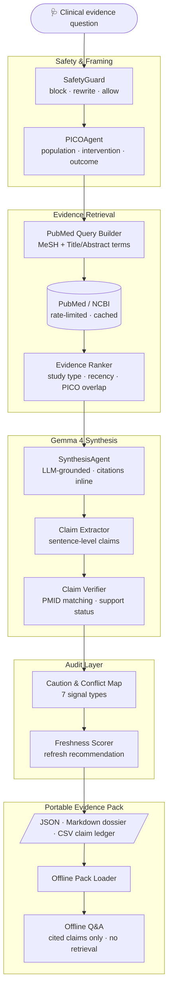

# VeritasClin Field

Offline-first, audit-ready medical evidence packs powered by Gemma 4.

> Medical AI should not just answer. It should carry its evidence with it.

[](https://github.com/sfnc01/veritasclin-gemma4/actions/workflows/ci.yml)
[](https://www.python.org/)
[](https://streamlit.io/)
[](https://docs.pydantic.dev/)
[](https://pubmed.ncbi.nlm.nih.gov/)
[](#offline-mode)
[](https://ollama.com)
[](LICENSE)


**VeritasClin Field turns PubMed into portable Evidence Packs for healthcare teams working under low-connectivity, high-risk, and high-accountability conditions.**

It is not a generic PubMed chatbot, an AI doctor, a diagnosis tool, a prescription tool, or a clone of Elicit, Consensus, Perplexity, Semantic Scholar, or scite.

## Runs on Ollama

VeritasClin Field runs Gemma 4 locally or via Ollama Cloud — no data sent to third-party APIs.

```bash
ollama pull gemma4:31b
GEMMA_PROVIDER=ollama streamlit run app/streamlit_app.py
```

For Ollama Cloud, add `OLLAMA_API_KEY` to `.env` — the app switches automatically between local and cloud. Gemma 4's **multimodal** capability (image input), **native function calling** (PubMed query construction), and **long-context reasoning** (evidence synthesis over multiple abstracts) are all used in the live pipeline.

## Demo

Primary hackathon story:

1. A public health worker builds an Evidence Pack for severe dengue warning signs while online.
2. The pack is exported as JSON, Markdown, CSV, and caution-map artifacts.
3. The worker loads the pack offline.
4. They ask in Portuguese: `Quais sinais indicam maior risco de dengue grave?`
5. VeritasClin answers only from the loaded pack, with cited claims, a Claim Ledger, a Caution & Conflict Map, and a safety notice.

> **Live demo:** Run `streamlit run app/streamlit_app.py` and select the dengue demo question. See `docs/demo_script.md` for the full 3-minute walkthrough script.

## Why It Matters

| Problem in medical AI | VeritasClin Field response |
| --- | --- |
| Answers vanish after chat | Exports portable Evidence Packs |
| Citations are decoration | Every clinical claim is logged and verified |
| Online-only tools fail in the field | Offline Q&A uses only the loaded pack |
| Risky prompts can become advice | SafetyGuard blocks or rewrites unsafe requests |
| Evidence quality is easy to miss | Ranking, freshness, and caution mapping stay visible |

## Differentiation

| Capability | Generic research assistants | VeritasClin Field |
| --- | --- | --- |
| Primary unit | Search result or chat answer | Portable Evidence Pack |
| Offline workflow | Usually no | Yes, loaded pack only |
| Claim audit trail | Partial or hidden | Claim Ledger is central |
| Medical safety stance | Varies by model | Deterministic guardrails first |
| PubMed reproducibility | Often opaque | Query, PMIDs, timestamps, and exports travel together |
| Low-connectivity use | Not the target | Core product constraint |
| Gemma role | Optional answer generation | Local reasoning, rewriting, synthesis, and offline Q&A |

## Architecture



## Core Concepts

| Concept | What it means |
| --- | --- |
| Evidence Pack | A portable review artifact containing the question, PICO, PubMed query, papers, ranked evidence, claims, cautions, freshness, summaries, and exports. |
| Claim Ledger | A table of clinically meaningful claims with support status, cited PMIDs or mock evidence IDs, evidence level, risk level, rationale, and limitations. |
| Offline Mode | A loaded pack can answer questions without PubMed, internet access, or external retrieval. Unsupported questions are refused. |
| Caution & Conflict Map | A structured list of uncertainty signals such as low certainty, indirect evidence, population mismatch, safety signals, or insufficient data. |

### Evidence Packs

An Evidence Pack is the portable source of truth: `pack.json` plus human-readable exports for review, teaching, audit, and low-connectivity reuse.

### Claim Ledger

The Claim Ledger separates medical claims from prose. Each claim has support status, cited PMIDs or mock evidence IDs, evidence level, risk level, rationale, and limitations.

### Offline Mode

Offline Mode loads a local pack and answers only from that pack. If the pack cannot support an answer, VeritasClin says so instead of retrieving or improvising.

### Caution & Conflict Map

The caution map highlights why evidence should be interpreted carefully, including low certainty, indirect evidence, mismatched populations or outcomes, safety signals, and insufficient data.

## Quickstart

```bash
python -m venv .venv
source .venv/bin/activate
pip install -r requirements.txt
cp .env.example .env
streamlit run app/streamlit_app.py
```

Open Streamlit and choose the dengue demo:

```text
What does recent evidence say about warning signs for severe dengue in adults?
```

## LLM Provider

| Mode | `GEMMA_PROVIDER` | Gemma 4 active | Requires |
| --- | --- | --- | --- |
| Default (demo) | `mock` | No — deterministic mock responses | Nothing |
| Local inference | `ollama` | Yes — synthesis, explanation, baseline | Ollama + `gemma4:31b` |
| API inference | `openai_compatible` | Yes — same as Ollama path | API endpoint + key |

**In mock mode**, synthesis uses deterministic template responses that include mock evidence IDs. All other pipeline steps (safety guard, PICO extraction, evidence ranking, claim verification, offline Q&A) use deterministic rule-based logic in all modes — Gemma 4 is used for the generative synthesis and patient explanation steps.

Set `GEMMA_PROVIDER=ollama` to enable live Gemma 4 inference for synthesis and patient-friendly explanations.

## Mock Mode

Mock mode is the default no-credential path.

```bash
GEMMA_PROVIDER=mock
```

It works without external keys, Ollama, or network access. Mock evidence is clearly labeled and uses IDs such as `MOCK-DENGUE-001`; it never invents real PMIDs. Synthesis responses are deterministic.

## Ollama / Gemma Mode

Use local Gemma 4 through Ollama:

```bash
GEMMA_PROVIDER=ollama
GEMMA_MODEL=gemma4:31b
OLLAMA_BASE_URL=http://localhost:11434   # or https://ollama.com for Ollama Cloud
OLLAMA_API_KEY=your_key                 # required for Ollama Cloud
```

In Ollama mode, Gemma 4 is called at seven points in the pipeline:

| Step | Gemma 4 capability used |
| --- | --- |
| Image input (optional) | Multimodal — reads clinical images, lab reports, charts |
| PICO extraction | Text reasoning — extracts population, intervention, outcome |
| Safety rewrite | Text reasoning — rewrites unsafe prompts as research questions |
| PubMed query | **Native function calling** — calls `set_pubmed_query` tool with optimal MeSH terms |
| Evidence synthesis | Long-context reasoning — synthesises over multiple PubMed abstracts |
| Patient explanation | Text generation — plain-language summary |
| Offline Q&A | Retrieval-augmented generation — answers from loaded pack claims only |

Deterministic code handles evidence ranking, citation coverage, claim verification, caution mapping, freshness scoring, and pack serialization — Gemma 4 is not given free rein over safety-critical outputs.

## PubMed / NCBI Mode

Set local credentials in `.env`:

```bash
NCBI_API_KEY=your_key
NCBI_EMAIL=you@example.org
NCBI_TOOL=veritasclin-field
NCBI_MAX_RPS=3
```

Secrets are never committed or printed. Tests pass without credentials. With credentials, integration tests verify real numeric PMIDs and Entrez History Server metadata for the dengue demo query.

The PubMed client follows NCBI Entrez E-utilities guidance: it includes `tool` and `email` when configured, honors `NCBI_MAX_RPS`, supports `retstart`/`retmax`, can request `usehistory=y`, and batches EFetch calls at about 200 PMIDs per request.

## Safety Model

VeritasClin Field is designed for evidence review, not individualized care.

| Request type | Behavior |
| --- | --- |
| General biomedical evidence question | Allowed |
| Dosing or treatment advice | Rewritten into a research question when safe |
| Diagnosis of a person | Blocked |
| Emergency triage | Blocked with urgent-care language |
| Medication stop/start instructions | Blocked |
| Patient-identifiable records | Blocked |

Hard rule: **no PMID/PMCID or explicit mock evidence ID, no strong clinical claim.**

## Evaluation

| Metric | Purpose |
| --- | --- |
| `citation_coverage` | Fraction of claims linked to pack evidence |
| `unsupported_claim_count` | Strong claims without sufficient support |
| `high_risk_unsupported_claim_count` | Unsupported claims with higher clinical risk |
| `baseline_vs_veritasclin_delta` | Unsupported-claim reduction versus plain model output |
| `pack_reproducibility_present` | Whether query, evidence, claims, and exports are present |
| `safety_rewrite_success` | Whether unsafe prompts are rewritten or blocked correctly |

Run the gate:

```bash
make test
make lint
```

For credentialed PubMed verification:

```bash
pytest
ruff check .
streamlit run app/streamlit_app.py
```

## Documentation

- [Architecture](docs/architecture.md)
- [Evidence Packs](docs/evidence_packs.md)
- [Safety Model](docs/safety.md)
- [Evaluation](docs/evaluation.md)
- [3-Minute Demo Script](docs/demo_script.md)
- [Judging Strategy](docs/judging_strategy.md)
- [Submission Checklist](docs/submission_checklist.md)

<details>
<summary>Example exported pack files</summary>

```text
pack.json
dossier.md
claim_ledger.csv
caution_map.json
```

</details>

## Roadmap

| Stage | Focus |
| --- | --- |
| Current MVP | Dengue Evidence Pack, offline Q&A, Claim Ledger, caution map, safety guard |
| Next | Richer multilingual wording, more example packs, stronger conflict detection |
| Later | Optional Kaggle notebook, richer visual reporting, additional public-health demos |

## Medical Disclaimer

VeritasClin Field is for biomedical evidence review and education. It does not provide diagnosis, prescription, emergency triage, or individualized medical advice. Healthcare decisions should be made by qualified professionals using local clinical protocols and current evidence.

## License

MIT.
