# VeritasClin Field

Offline-first, audit-ready medical evidence packs powered by Gemma 4.

VeritasClin Field turns PubMed into portable Evidence Packs for healthcare teams working under low-connectivity, privacy-sensitive, and high-accountability conditions.

## Problem

Clinicians, public health teams, researchers, and educators often need reliable medical evidence where connectivity is poor and accountability is high. Generic AI answers are not enough: medical claims need visible sources, safety limits, and reproducible review artifacts.

## Why Existing Research Assistants Are Not Enough

Tools like Elicit, Consensus, Semantic Scholar, Perplexity, and scite help search or summarize literature online. VeritasClin Field is different because it is built around field-ready evidence portability:

- Offline Evidence Packs instead of online-only chat.
- A Claim Ledger for every clinically meaningful statement.
- Caution and conflict mapping instead of citation decoration.
- Safety rewriting for risky medical prompts.
- Auditability: the PubMed query, papers, claims, cautions, and exports travel together.

## What It Is

VeritasClin Field is a Streamlit app and Python package that:

- Builds an Evidence Pack from a biomedical question.
- Searches PubMed/NCBI when credentials are configured.
- Falls back to deterministic mock demo data when credentials or network are unavailable.
- Exports `pack.json`, `dossier.md`, `claim_ledger.csv`, and `caution_map.json`.
- Loads a pack offline and answers only from the loaded evidence.

## What It Is Not

VeritasClin Field is not an AI doctor, diagnosis tool, prescription tool, emergency triage tool, EHR integration, or generic chatbot. It does not process patient-identifiable records.

## Core Innovations

**Evidence Packs** preserve the clinical question, PICO, search strategy, ranked evidence, synthesis, claims, cautions, freshness, and exports in a portable artifact.

**Claim Ledger** treats each medical claim as an auditable object with support status, PMID/mock evidence ID, evidence level, risk level, rationale, and limitations.

**Offline Mode** answers from a loaded pack only. If the pack does not contain enough evidence, it says so and does not call PubMed.

**Caution & Conflict Map** highlights low certainty, insufficient data, indirect evidence, and mismatch risks without overstating contradictions.

## Why Gemma 4

Gemma 4 is positioned as the local reasoning layer for PICO extraction, safe rewriting, evidence synthesis, patient-friendly explanation, offline Q&A, and baseline comparison. Deterministic code handles hard safety checks, ranking, citation coverage, unsupported claim detection, and serialization.

## Why PubMed/NCBI

PubMed is public, trusted, widely recognized, and suitable for an open-source medical evidence demo. VeritasClin keeps the query visible so reviewers can audit how evidence entered the pack.

## Quickstart

```bash
python -m venv .venv
source .venv/bin/activate
pip install -r requirements.txt
cp .env.example .env
streamlit run app/streamlit_app.py
```

## Mock Mode

Mock mode is the default. It needs no credentials, no Ollama, and no network. Mock records are clearly labeled and use IDs such as `MOCK-DENGUE-001`, never fake real PMIDs.

## Ollama / Gemma Mode

Set:

```bash
GEMMA_PROVIDER=ollama
GEMMA_MODEL=gemma4:e4b
OLLAMA_BASE_URL=http://localhost:11434
```

If Ollama is unavailable, the provider fails gracefully.

## PubMed Credentials

Set these in `.env`:

```bash
NCBI_API_KEY=your_key
NCBI_EMAIL=you@example.org
NCBI_TOOL=veritasclin-field
NCBI_MAX_RPS=3
```

Secrets are never committed or printed. Tests pass without credentials.

## Demo Workflow

1. Build a pack for: `What does recent evidence say about warning signs for severe dengue in adults?`
2. Inspect PICO, PubMed query, Evidence Map, Claim Ledger, and Caution Map.
3. Download `pack.json` and `dossier.md`.
4. Load `pack.json` offline.
5. Ask: `Quais sinais indicam maior risco de dengue grave?`
6. Compare a plain model answer against VeritasClin citation coverage.
7. Try the unsafe dosing demo: `What dose of semaglutide should I take if I have CKD?`

## Safety Model

The safety guard allows general evidence questions, rewrites dosing/treatment prompts into research questions, and blocks emergency triage, diagnosis of individuals, medication changes, and identifiable patient data.

Hard rule: no PMID/PMCID or explicit mock evidence ID, no strong clinical claim.

## Evaluation

The project includes simple metrics:

- Citation coverage.
- Unsupported claim count.
- High-risk unsupported claim count.
- Baseline vs VeritasClin delta.
- Pack reproducibility present.
- Safety rewrite success.

Run:

```bash
make test
make lint
```

## Architecture

```mermaid
flowchart LR
  Q["Clinical evidence question"] --> S["SafetyGuard"]
  S --> P["PICOAgent"]
  P --> R["PubMed query"]
  R --> E["PubMed or mock evidence"]
  E --> K["EvidenceRanker"]
  K --> Y["SynthesisAgent"]
  Y --> C["Claim Ledger"]
  C --> M["Caution Map"]
  M --> X["Evidence Pack exports"]
  X --> O["Offline Q&A"]
```



## Roadmap

- Better conflict detection across study designs.
- Richer multilingual patient explanations.
- Optional Kaggle notebook and demo video assets.
- More curated example packs.

## License

MIT.

