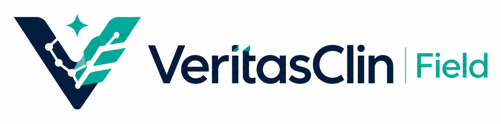
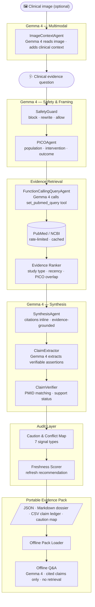

<p align="center">
  
</p>

<p align="center">
  <strong>Offline-first, audit-ready medical evidence packs powered by Gemma 4.</strong><br>
  <em>Medical AI should not just answer. It should carry its evidence with it.</em>
</p>

<p align="center">
  <a href="https://github.com/sfnc01/veritasclin-gemma4/actions/workflows/ci.yml"></a>
  <a href="https://www.python.org/"></a>
  <a href="https://streamlit.io/"></a>
  <a href="https://docs.pydantic.dev/"></a>
  <a href="https://pubmed.ncbi.nlm.nih.gov/"></a>
  <a href="#offline-mode"></a>
  <a href="https://ollama.com"></a>
  <a href="LICENSE"></a>
</p>

---

VeritasClin Field turns PubMed into portable Evidence Packs for healthcare teams working under low-connectivity, high-risk, and high-accountability conditions.

It is not a generic PubMed chatbot, an AI doctor, a diagnosis tool, a prescription tool, or a clone of Elicit, Consensus, Perplexity, Semantic Scholar, or scite.

## The Problem

Healthcare workers in the field — outbreak responders, rural clinicians, field epidemiologists — need trustworthy clinical evidence that travels with them. Existing AI tools are online-only, citation-free, and produce answers with no audit trail. When connectivity drops, the answer disappears too.

## The Solution

VeritasClin Field uses Gemma 4's three flagship capabilities — **multimodal input**, **native function calling**, and **long-context reasoning** — to turn a clinical question into a fully portable, citable Evidence Pack that works offline.

## Runs on Ollama

VeritasClin Field runs Gemma 4 with no data sent to third-party APIs. Choose the path that fits your hardware:

**Option A — Ollama Cloud** (no GPU required, API key needed):

```bash
# .env
GEMMA_PROVIDER=ollama
GEMMA_MODEL=gemma4:31b
OLLAMA_BASE_URL=https://ollama.com
OLLAMA_API_KEY=your_key          # get one at ollama.com/settings/keys
```

**Option B — Local Ollama** (runs on consumer hardware with the efficiency variant):

```bash
ollama pull gemma4:e4b           # quantised 4-bit variant, ~8 GB VRAM
# .env
GEMMA_PROVIDER=ollama
GEMMA_MODEL=gemma4:e4b
OLLAMA_BASE_URL=http://localhost:11434
```

Then start the app either way:

```bash
streamlit run app/streamlit_app.py
```

Gemma 4's **multimodal** capability (clinical image input), **native function calling** (PubMed query construction), and **long-context reasoning** (evidence synthesis over multiple abstracts) are all used in the live pipeline.

## Demo

Primary hackathon story:

1. A public health worker builds an Evidence Pack for severe dengue warning signs while online.
2. The pack is exported as JSON, Markdown, CSV, and caution-map artifacts.
3. The worker loads the pack offline.
4. They ask in Portuguese: `Quais sinais indicam maior risco de dengue grave?`
5. VeritasClin answers only from the loaded pack, with cited claims, a Claim Ledger, a Caution & Conflict Map, and a safety notice.

> **Live demo:** Run `streamlit run app/streamlit_app.py` and select the dengue demo question. See `docs/demo_script.md` for the full 3-minute walkthrough script.

## Why It Matters

| Problem in medical AI | VeritasClin Field response |
| --- | --- |
| Answers vanish after chat | Exports portable Evidence Packs |
| Citations are decoration | Every clinical claim is logged and verified |
| Online-only tools fail in the field | Offline Q&A uses only the loaded pack |
| Risky prompts can become advice | SafetyGuard blocks or rewrites unsafe requests |
| Evidence quality is easy to miss | Ranking, freshness, and caution mapping stay visible |

## Differentiation

| Capability | Generic research assistants | VeritasClin Field |
| --- | --- | --- |
| Primary unit | Search result or chat answer | Portable Evidence Pack |
| Offline workflow | Usually no | Yes, loaded pack only |
| Claim audit trail | Partial or hidden | Claim Ledger is central |
| Medical safety stance | Varies by model | Deterministic guardrails first |
| PubMed reproducibility | Often opaque | Query, PMIDs, timestamps, and exports travel together |
| Low-connectivity use | Not the target | Core product constraint |
| Image / document input | Rarely | Multimodal — Gemma 4 reads clinical images into the question |
| Query construction | Fixed template | Native function calling — Gemma 4 calls `set_pubmed_query` tool |
| Gemma role | Optional answer generation | Multimodal input · function calling · synthesis · offline Q&A |

## Architecture



## Gemma 4 in the Pipeline

In Ollama mode, Gemma 4 is called at seven points:

| Step | Gemma 4 capability |
| --- | --- |
| Image input (optional) | **Multimodal** — reads clinical images, lab reports, charts |
| PICO extraction | Text reasoning — population, intervention, outcome |
| Safety rewrite | Text reasoning — rewrites unsafe prompts as research questions |
| PubMed query | **Native function calling** — calls `set_pubmed_query` tool with MeSH terms |
| Evidence synthesis | Long-context reasoning — synthesises over multiple PubMed abstracts |
| Patient explanation | Text generation — plain-language summary |
| Offline Q&A | RAG — answers from loaded pack claims only, no external retrieval |

Deterministic code handles ranking, citation coverage, claim verification, caution mapping, freshness scoring, and serialization.

## Core Concepts

| Concept | What it means |
| --- | --- |
| Evidence Pack | A portable review artifact containing the question, PICO, PubMed query, papers, ranked evidence, claims, cautions, freshness, summaries, and exports. |
| Claim Ledger | A table of clinically meaningful claims with support status, cited PMIDs or mock evidence IDs, evidence level, risk level, rationale, and limitations. |
| Offline Mode | A loaded pack can answer questions without PubMed, internet access, or external retrieval. Unsupported questions are refused. |
| Caution & Conflict Map | A structured list of uncertainty signals such as low certainty, indirect evidence, population mismatch, safety signals, or insufficient data. |

## Quickstart

```bash
python -m venv .venv
source .venv/bin/activate
pip install -r requirements.txt
cp .env.example .env
streamlit run app/streamlit_app.py
```

Open Streamlit and choose the dengue demo:

```text
What does recent evidence say about warning signs for severe dengue in adults?
```

## LLM Provider

| Mode | `GEMMA_PROVIDER` | Gemma 4 active | Requires |
| --- | --- | --- | --- |
| Default (demo) | `mock` | No — deterministic mock responses | Nothing |
| Ollama Cloud | `ollama` | Yes — full pipeline | Ollama Cloud key + `gemma4:31b` |
| Local Ollama | `ollama` | Yes — full pipeline | Ollama installed + `gemma4:e4b` |
| API inference | `openai_compatible` | Yes — same as Ollama path | API endpoint + key |

In **mock mode**, synthesis uses deterministic template responses so the app runs without any keys. Set `GEMMA_PROVIDER=ollama` to activate the full live pipeline, where Gemma 4 is called at all seven points above.

## PubMed / NCBI Mode

Set credentials in `.env`:

```bash
NCBI_API_KEY=your_key
NCBI_EMAIL=you@example.org
NCBI_TOOL=veritasclin-field
NCBI_MAX_RPS=3
```

Secrets are never committed or printed. Tests pass without credentials. The PubMed client follows NCBI Entrez E-utilities guidance: it includes `tool` and `email` when configured, honors `NCBI_MAX_RPS`, supports `retstart`/`retmax`, can request `usehistory=y`, and batches EFetch calls at about 200 PMIDs per request.

## Safety Model

VeritasClin Field is designed for evidence review, not individualized care.

| Request type | Behavior |
| --- | --- |
| General biomedical evidence question | Allowed |
| Dosing or treatment advice | Rewritten into a research question when safe |
| Diagnosis of a person | Blocked |
| Emergency triage | Blocked with urgent-care language |
| Medication stop/start instructions | Blocked |
| Patient-identifiable records | Blocked |

Hard rule: **no PMID/PMCID or explicit mock evidence ID, no strong clinical claim.**

## Evaluation

| Metric | Purpose |
| --- | --- |
| `citation_coverage` | Fraction of claims linked to pack evidence |
| `unsupported_claim_count` | Strong claims without sufficient support |
| `high_risk_unsupported_claim_count` | Unsupported claims with higher clinical risk |
| `baseline_vs_veritasclin_delta` | Unsupported-claim reduction versus plain model output |
| `pack_reproducibility_present` | Whether query, evidence, claims, and exports are present |
| `safety_rewrite_success` | Whether unsafe prompts are rewritten or blocked correctly |

```bash
make test      # 39 unit tests, no credentials required
make lint      # ruff check
```

## Example Evidence Packs

Three real-data packs are included in [`examples/`](examples/), each built with live PubMed retrieval and Gemma 4 via Ollama Cloud. Each pack contains 10 papers with real numeric PMIDs, a Claim Ledger, a Caution Map, and all four export formats.

| Topic | Query method | Papers |
| --- | --- | --- |
| [Severe dengue warning signs in adults](examples/dengue_severe_adults_pack/) | Gemma 4 function calling | 10 real PMIDs |
| [Semaglutide safety and renal outcomes in CKD](examples/semaglutide_ckd_pack/) | Gemma 4 function calling | 10 real PMIDs |
| [Medical cannabis for neuropathic pain](examples/cannabis_neuropathic_pain_pack/) | Gemma 4 function calling | 10 real PMIDs |

Each directory contains: `pack.json` · `dossier.md` · `claim_ledger.csv` · `caution_map.json`

## Documentation

| Document | What it covers |
| --- | --- |
| [Architecture](docs/architecture.md) | Pipeline flow, module responsibilities, failure strategy |
| [Evidence Packs](docs/evidence_packs.md) | Pack schema, export formats, offline guarantees |
| [Safety Model](docs/safety.md) | Guard categories, rewrite logic, hard rules |
| [Evaluation](docs/evaluation.md) | Metrics, baselines, reproducibility criteria |
| [3-Minute Demo Script](docs/demo_script.md) | Step-by-step walkthrough for judges and presenters |
| [Judging Strategy](docs/judging_strategy.md) | Alignment with hackathon criteria |
| [Submission Checklist](docs/submission_checklist.md) | Pre-submission verification list |

## Roadmap

**v0.1 — Hackathon MVP** ✅ Complete

- Live Gemma 4 pipeline: multimodal image input, native function calling for PubMed query construction, LLM synthesis, LLM claim extraction, LLM PICO extraction, offline Q&A
- Portable Evidence Pack: Claim Ledger, Caution & Conflict Map, freshness score, 4 export formats (JSON, Markdown, CSV, caution JSON)
- SafetyGuard: 6-category detection, deterministic blocking, LLM-backed rewrite
- Evaluation module: citation coverage, unsupported-claim delta, reproducibility score, baseline comparison
- Three curated real-data demo packs (dengue, semaglutide/CKD, cannabis) — 10 real PubMed papers each
- Multilingual offline Q&A: English, Portuguese, Spanish

**v0.2 — Post-hackathon** — Additional public-health demo packs (malaria, TB, maternal health); LLM-backed caution reasoning; stronger conflict detection.

**Later** — Fine-tuned Gemma 4 for medical PICO extraction; Kaggle notebook; FHIR-compatible pack export.

## Medical Disclaimer

> VeritasClin Field is for biomedical evidence review and education only. It does not provide diagnosis, prescription, emergency triage, or individualised medical advice. All clinical decisions must be made by qualified healthcare professionals using local protocols and current evidence.

## License

[MIT](LICENSE)
