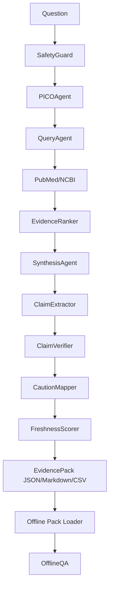

# Architecture

VeritasClin Field is organized around one artifact: the Evidence Pack. The online build path gathers and verifies evidence; the offline path only reads the pack.

## Online Build Mode

The build path performs safety checking, PICO extraction, auditable query generation, PubMed retrieval when configured, ranking, synthesis, claim verification, caution mapping, and export.

If PubMed credentials are configured, the app uses NCBI E-utilities and caches responses.
If credentials or retrieval fail, the UI clearly labels mock fallback data.

The PubMed layer uses ESearch for PMID discovery and EFetch XML for records. It keeps the
query visible, supports `retstart`/`retmax` pagination, can request Entrez History Server
metadata with `usehistory=y`, and batches EFetch retrieval to stay within NCBI guidance for
UID lists. `tool`, `email`, and `api_key` are passed only as request parameters and are never
printed in logs or exports.

## Offline Query Mode

Offline mode loads `pack.json` and answers only from the included papers, evidence items, and Claim Ledger. It does not call PubMed or any external retrieval service.
