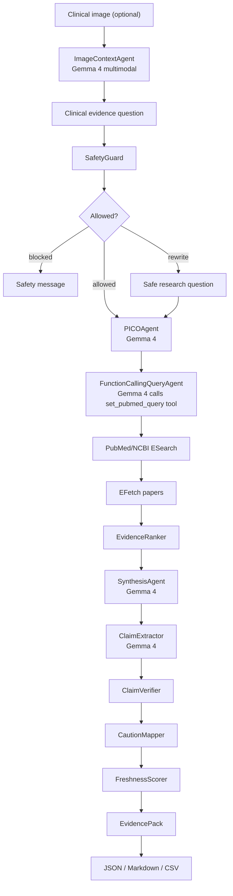
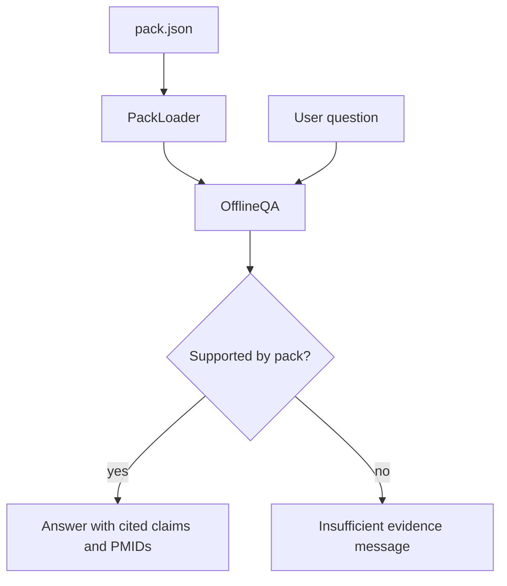

# Architecture

VeritasClin Field has two paths: an online build path that creates an Evidence Pack, and an offline Q&A path that reads only that pack.

## Online Build Flow

The build path performs safety checking, optional multimodal image analysis, PICO extraction, native function-calling query generation, PubMed retrieval when configured, ranking, synthesis, claim verification, caution mapping, freshness scoring, and export.

## Offline Q&A Flow

Offline mode does not call PubMed, Ollama, OpenAI-compatible APIs, or any external retrieval service. It answers from the loaded pack's papers, ranked evidence, Claim Ledger, and caution map.

## Modules

| Module | Responsibility |
| --- | --- |
| `veritasclin.config` | Loads environment settings from `.env` without exposing secrets |
| `veritasclin.schemas` | Pydantic v2 models for PICO, papers, evidence, claims, cautions, packs, and baseline metrics |
| `veritasclin.llm` | Provider abstraction for mock mode, Ollama/Gemma, and optional OpenAI-compatible endpoints |
| `veritasclin.tools.pubmed` | NCBI E-utilities client for ESearch, Entrez History metadata, EFetch XML, caching, and rate limiting |
| `veritasclin.agents.safety_guard` | Deterministic classification, blocking, and safe rewriting |
| `veritasclin.agents.image_context_agent` | Gemma 4 multimodal — reads clinical images and adds context to the question |
| `veritasclin.agents.pico_agent` | Gemma 4 — extracts structured PICO fields from the safe research question |
| `veritasclin.agents.function_calling_query_agent` | Gemma 4 native function calling — calls `set_pubmed_query` tool to build the PubMed query; falls back to `QueryAgent` on failure |
| `veritasclin.agents.query_agent` | Algorithmic fallback query builder |
| `veritasclin.agents.evidence_ranker` | Scores papers by study type, abstract availability, term overlap, year, and clinical relevance |
| `veritasclin.agents.synthesis_agent` | Gemma 4 — produces executive summary, clinical interpretation, and patient-friendly explanation from ranked evidence |
| `veritasclin.agents.claim_extractor` | Extracts clinically meaningful claims from generated text |
| `veritasclin.agents.claim_verifier` | Links claims to PMIDs or flags unsupported strong claims |
| `veritasclin.agents.caution_mapper` | LLM-backed uncertainty appraisal plus keyword detection for 7 caution types |
| `veritasclin.agents.freshness_scorer` | Calculates freshness score and refresh recommendation |
| `veritasclin.packs` | Builds, serializes, loads, and queries Evidence Packs |
| `veritasclin.exporters` | Writes Markdown, JSON, CSV, and caution-map exports |
| `app.streamlit_app` | Hackathon demo UI centered on the Evidence Pack and Claim Ledger |

## PubMed / NCBI Behavior

The PubMed layer uses ESearch for PMID discovery and EFetch XML for metadata. It keeps the query visible, supports `retstart`/`retmax` pagination, can request Entrez History Server metadata with `usehistory=y`, and batches EFetch retrieval to stay within NCBI guidance for UID lists.

`tool`, `email`, and `api_key` are passed only as request parameters. They are not printed in logs, not exported in packs, and not committed.

## Failure Strategy

| Failure | Behavior |
| --- | --- |
| Missing NCBI credentials | Use deterministic mock evidence |
| PubMed network/API failure | Fail gracefully and keep UI responsive |
| Missing Ollama | Fall back or show provider error without crashing |
| Unsupported offline question | Say the loaded pack does not support an answer |
| Strong uncited claim | Mark unsupported in the Claim Ledger |
